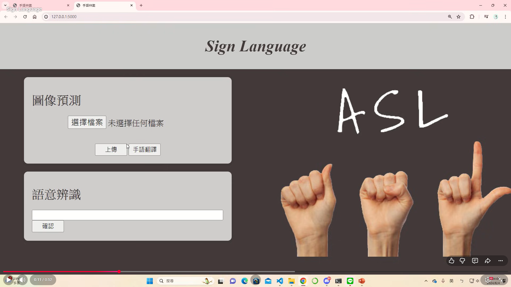
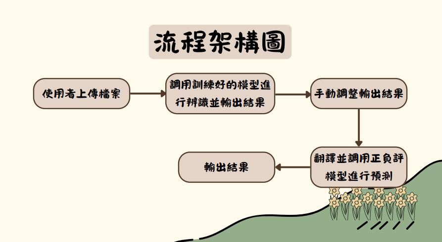
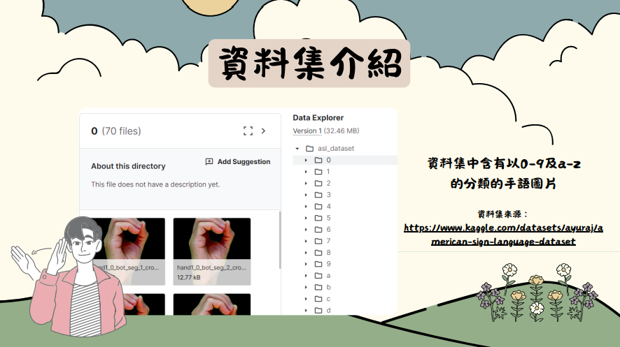

# Sign Language Recognition & Sentiment Analysis

全端手語影像辨識與自然語言情緒分析系統
**Full-Stack Sign Language Recognition and Sentiment Analysis System using CNN and BERT**

本專案結合**電腦視覺 (CV)** 與**自然語言處理 (NLP)**，開發出一套具備網頁互動介面的全端 AI 應用。系統不僅能辨識使用者上傳的手語影像（包含數字 0-9 與字母 a-z），還能將辨識出的單字翻譯為繁體中文，並進一步調用大型語言模型進行正負面情緒分析。

---

## Overview

**系統完整分析流程：**

`Image Upload` ➔ `CNN Sign Language Recognition` ➔ `Googletrans Translation` ➔ `BERT Sentiment Analysis` ➔ `Web UI Display`

| 開發模組 | 核心技術 | 對應程式碼 / 檔案 |
| :--- | :--- | :--- |
| **1. 後端與 API** | Flask 後端伺服器與 Ajax 非同步請求 | [`main.py`](./main.py) |
| **2. 手語辨識 (CV)** | Keras, CNN 模型訓練與資料擴增 | [`model.ipynb`](./model.ipynb) |
| **3. NLP 資料工程** | Selenium 爬蟲與正負評語料庫建置 | [`web_scraping.ipynb`](./web_scraping.ipynb) |
| **4. 翻譯測試** | Googletrans API 功能驗證 | [`api_test_translation.ipynb`](./api_test_translation.ipynb) |
| **5. 前端介面** | HTML, CSS, JavaScript | `/templates`, `/static` |

*(註：因模型權重檔超出 GitHub 容量限制，已將兩個核心模型分別開源發布至 Hugging Face Model Hub。)*

**[CNN 手語辨識模型 (categorical_model.h5) - Hugging Face](https://huggingface.co/你的帳號名稱/Sign-Language-Models)**
**[BERT 正負評語言模型 (bert_chinese_model) - Hugging Face](https://huggingface.co/你的帳號名稱/Sign-Language-Models)**

---

## 專題成果展示

### 網頁實機操作與系統演示 (YouTube)
點擊下方圖片即可觀看完整的系統操作影片，包含手語圖片上傳、即時辨識、翻譯與情緒分析結果展示：

[](https://youtu.be/jHTMCEvQBkA)

*(實機操作介面截圖)*


### [專題完整簡報 (Presentation PDF)](./Presentation.pdf)

---

## 專題動機與目的

對於不熟悉手語的大眾而言，理解手語的含義具有一定的門檻。本專案希望能透過架設互動式網頁，讓使用者輸入手勢圖片後，系統能自動辨識該手勢的意思。為了賦予系統更深層的理解能力，我們進一步串接 NLP 模型，判斷該手語辭彙所代表的正負面情緒意義，以期建立更友善的無障礙溝通橋樑。

---

## 系統架構圖

本系統將前端介面、影像辨識模型與語言分析模型進行無縫整合：



1. **使用者上傳檔案**：透過 Web 介面選擇手語圖片。
2. **調用影像模型**：後端 Flask 接收影像後，送入訓練好的 CNN 模型進行特徵萃取與類別預測。
3. **翻譯與情緒分析**：將預測出的英文字彙翻譯成中文，並送入微調過後的 BERT 模型判定為「正評」或「負評」。
4. **輸出結果**：將最終的辨識結果、中文翻譯與情緒標籤動態回傳至前端展示。

---

## 資料集與模型訓練

本專案涵蓋兩種不同領域的機器學習模型訓練與調校：

### 1. 電腦視覺：手語分類模型 (CNN)
* **資料來源**：[Kaggle American Sign Language Dataset](https://www.kaggle.com/datasets/ayuraj/american-sign-language-dataset)
* **資料規模**：共 36 個類別（數字 0-9 與英文字母 a-z），總計 2515 張圖片。
* **資料前處理**：依 80% / 20% 比例切分為訓練集與測試集，並透過 `ImageDataGenerator` 進行資料擴增 (Data Augmentation) 如旋轉、平移與水平翻轉。
* **模型架構**：建立深度卷積神經網路 (CNN)，包含兩層 `Conv2D` + `MaxPooling2D`，並使用 `Dropout` 防止過擬合。最終全連接層使用 Softmax 輸出 36 種機率分佈。
* **測試準確率**：經過 300 Epochs 訓練，最終模型 (`categorical_model.h5`) 準確率高達 **92.8%**。



### 2. 自然語言處理：正負評分類模型 (BERT)
* **資料收集與前處理**：利用 Selenium 撰寫自動化爬蟲，擷取 2098 則真實評論資料進行訓練，並建立正向 (`positive.txt`) 與負向 (`negative.txt`) 語意字典檔。
* **模型架構**：採用 Hugging Face 的 `bert-base-chinese` 預訓練模型進行序列分類微調 (Sequence Classification Fine-tuning)。
* **推論邏輯**：藉由 PyTorch 將輸入文本轉為 Tensor，利用微調後的 BERT 提取語意特徵並進行 Argmax 分類，準確預測辭彙的情感傾向。雲端模型庫中包含權重檔 `model.safetensors` 與架構檔 `config.json`。

---

## 未來發展

* **擴充為即時動態影像辨識 (Real-time Inference)**：從目前的「靜態圖片上傳」升級為「動態影像即時串流辨識」，結合 WebRTC 或 OpenCV 即時捕捉使用者的連續手語動作。
* **細緻化情緒分析 (Fine-grained Sentiment Analysis)**：將 NLP 模型目前的「正/負評」二元分類，進階為多維度情緒辨識（如：快樂、悲傷、驚訝等），使語意分析更貼近人類真實情感。
* **擴增手語詞彙庫**：目前影像資料集以字母與數字為主，未來計畫引入常見的「單字與短句」手語資料集，提升系統在日常情境下的實用性。
* **系統雲端部署 (Cloud Deployment)**：將整個 Flask 應用程式 Docker 化，並部署至 AWS、GCP 或 Render 等雲端平台，實現真正的線上無障礙溝通服務。

---

## 使用技術棧 (Tech Stack)

| 領域 | 技術與套件 |
| :--- | :--- |
| **Backend** | Python, Flask, Werkzeug |
| **Computer Vision** | TensorFlow, Keras, OpenCV (`cv2`), Pillow |
| **Natural Language Processing** | PyTorch, Transformers (Hugging Face), Jieba |
| **Frontend** | HTML5, CSS3, JavaScript, jQuery (Ajax) |
| **Data Engineering** | Selenium, NumPy, scikit-learn, Pandas |
| **Third-party API** | Googletrans |

---

## 專案結構

```text
Sign-Language-Recognition/
│
├── main.py                          # Flask 後端主程式與 API 路由設定
├── model.ipynb                      # 手語 CNN 模型訓練與資料擴增程式碼
├── web_scraping.ipynb               # Selenium 爬蟲與資料前處理腳本
├── api_test_translation.ipynb       # 翻譯功能 API 測試腳本
│
├── data/                            # NLP 訓練語料與情感字典檔
│   ├── data.csv
│   ├── positive.txt
│   └── negative.txt
│
├── templates/
│   └── home.html                    # 前端網頁介面
├── static/
│   ├── css/style.css                # 網頁樣式檔
│   └── js/event.js                  # Ajax 非同步請求邏輯
│
├── Img/                             # README 展示用圖片
│   ├── architecture.png
│   ├── ui_demo.png
│   └── dataset.png
│
├── requirements.txt                 # 環境依賴套件清單
├── Sign_Langusge_期末_(1)_2.pdf     # 專題簡報檔案
└── README.md
```

---

## 個人貢獻與組內分工

在本次三人團隊專題中，團隊成員各佔 33% 貢獻度，共同參與了從概念發想到模型落地的各個階段：

* **資料工程與蒐集**：撰寫爬蟲腳本擷取評論資料，並尋找 Kaggle ASL 資料集。
* **概念發想與架構設計**：確立 CV 結合 NLP 的雙模型全端應用架構。
* **模型建置與程式碼開發**：撰寫 CNN 影像分類網路、微調 BERT 語言模型、以及架設 Flask 後端與前端互動腳本。
* **專題簡報製作**：統整實驗數據與模型架構進行視覺化呈現。

---

## 專題資訊

**專題名稱**：全端手語影像辨識與自然語言情緒分析系統

**專題成員**：
* 温苡均
* 黃妤涵
* 李佩臻
